# 1 Overview

1. __丰富的原子能力__
    * Action
    * Condition
    * Gateway
        * JoinGateway
            * hard
            * soft
            * or
        * ExclusiveGateway
    * Listener
        * event
            * before
            * success
            * failure
        * scope
            * node
            * global
    * SubRule
1. __简洁的规则描述语言__
    * 级联
    * 并联
    * 聚合
    * 监听
    * `if`语句
    * `if else`语句
    * `select`语句
    * `join`语句
    * `join then`语句
    * `sub`语句
    * `sub then`语句
    * `sub then else`语句
1. __丰富的机制__
    * Promise
    * PromiseListener
    * DelegateInterceptor
    * DelegateField
    * 线程池隔离
    * 异步执行超时设置
1. __集成Spring-Boot-Starter__
1. __数据统计__
    * 执行链路
    * 变量更新记录
    * 节点执行时间
    * attribute

# 2 基础能力

## 2.1 核心接口介绍

 

1. `Element`: 定义规则中元素的基础能力，包含
    * `id`: 规则级别唯一的id
    * `type`: 元素的类型，详见`ElementType`
    * `rule`: 关联规则本身
1. `Attachable`: 可依附于某个节点，包含
    * `attachedId`: 被依附的节点id
1. `Executable`: 可执行Java逻辑的元素，包含
    * `name`: 元素名称
    * `argumentNames`: 参数名称
    * `argumentValues`: 参数值
1. `Node`: 定义规则中的节点，节点是规则中的最小拓扑单元，包含
    * `predecessors`: 前继集合
    * `successors`: 后继集合
    * `listeners`: 监听集合
1. `Conditional`: 规则中可以作为条件节点后继的节点，包含
    * `linktype`: 链路类型，包括`NORMAL`、`TRUE`、`FALSE`三种
1. `Listener`: 监听，包含
    * `scope`: 监听级别，包括`global`以及`node`
    * `event`: 事件类型，包括`before`、`success`以及`failure`
1. `Activity`: 该概念的定义，参考`flowable`
1. `Action`: 一个普通的执行节点
1. `Condition`: 一个条件执行节点
1. `Gateway`: 网关节点
1. `ExclusiveGateway`: 独占网关，仅允许后继第一个成立的`Condition`通过
1. `JoinGateway`: 聚合网关，聚合多个执行分支成一个分支
    * `joinMode`: 聚合模式，包括`hard`模式、`soft`模式以及`or`模式
    * `hard`表示当且仅当全部的前继节点都正常执行时，才允许通过
    * `soft`表示当且仅当全部的可达前继节点都正常执行时，才允许通过（换言之，允许不可达支路存在）
    * `or`表示当任意前继节点正常执行时，允许通过
1. `Rule`: 规则本身也可以作为节点存在于上一级的规则拓扑中（即子规则）

## 2.2 LinkType

__在规则引擎中，节点与节点之间的连线称为`Link`，其类型包含如下三种__

* `LinkType.TRUE`: true分支
* `LinkType.FALSE`: false分支
* `LinkType.NORMAL`: 默认分支

__其中，`Condition`以及`Rule`与后继节点的连线的类型是`LinkType.TRUE`或`LinkType.FALSE`；其余类型的节点与后继节点的连线的类型是`LinkType.NORMAL`，请参考如下示意图__

 

__在下文中，我们把某个节点与其后继节点的连线称为`后继Link`__

## 2.3 Node

__`Node`是规则拓扑结构中的最基本元素，而其他元素，例如`Listener`只能依附于`Node`而存在，`Node`包括：__

* `Action`
* `Condition`
* `JoinGateway`
* `ExclusiveGateway`
* `Rule`

## 2.4 Executable

`Executable`是可执行Java代码的元素，包括`Action`、`Condition`以及`Listener`

__注册__

1. 非spring环境下，需要通过`com.github.liuyehcf.framework.rule.engine.FlowEngine`的静态方法进行注册
    * `registerActionDelegateFactory`
    * `registerConditionDelegateFactory`
    * `registerListenerDelegateFactory`
1. 在spring环境下，无需任何配置，规则引擎会自动完成注册工作
    * `@Component`，节点名称就是bean的名称
    * `@ActionBean`，该注解默认标记了`@Component`，节点名称通过names指定，可以指定多个别名
    * `@ConditionBean`，该注解默认标记了`@Component`，节点名称通过names指定，可以指定多个别名
    * `@ListenerBean`，该注解默认标记了`@Component`，节点名称通过names指定，可以指定多个别名

__命名__

1. 标志符，例如`actionA`、`action1`、`_action_2`
1. 标志符结合`.`，例如`my.test.condition3`
1. 标志符结合`/`，例如`my/test/listener5`

### 2.4.1 Action

__`Action`是一个可执行Java代码的普通节点，`Action`只允许类型为`LinkType.NORMAL`的后继Link，其继承关系如下__

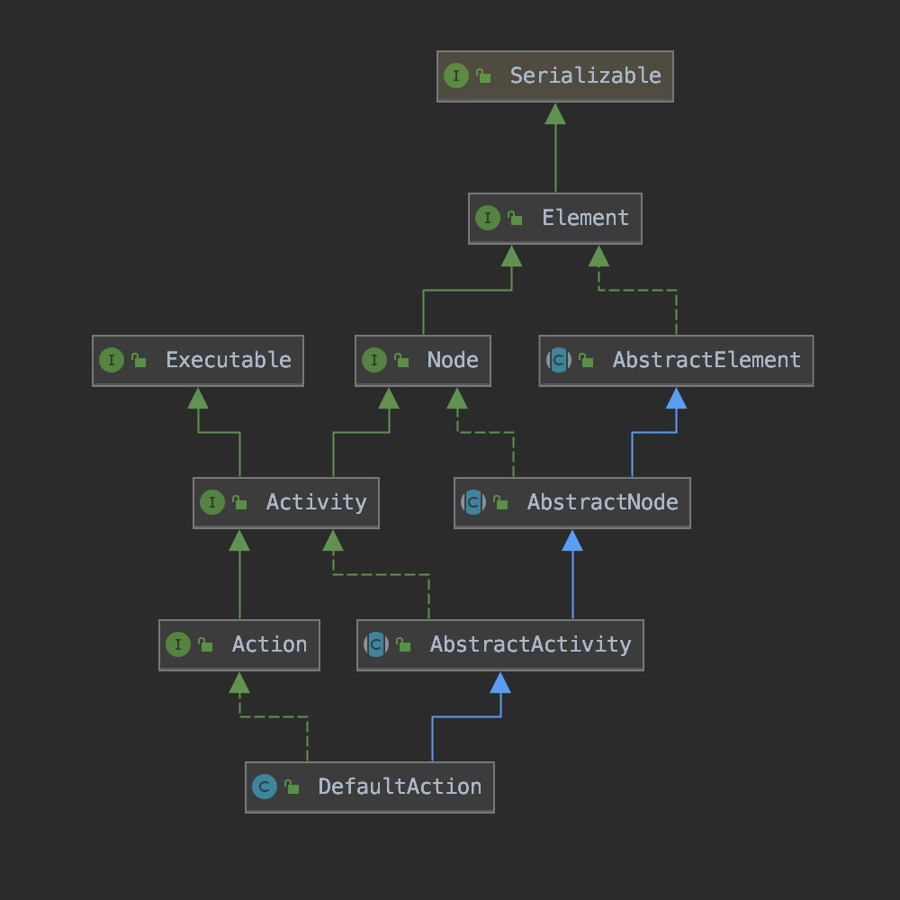 

如果我们要创建一个可以执行业务逻辑的`Action`，只需要实现`ActionDelegate`接口

```java
package com.github.liuyehcf.framework.rule.engine.runtime.delegate;

import com.github.liuyehcf.framework.flow.engine.runtime.delegate.context.ActionContext;

/**
 * @author hechenfeng
 * @date 2019/4/27
 */
public interface ActionDelegate extends Delegate {

    /**
     * method invoke when action is reached
     *
     * @param context context of execution
     * @throws Exception exceptions
     */
    void onAction(ActionContext context) throws Exception;
}
```

__其中，`context`可用于__

1. 获取属性值
1. 设置属性值（通过该方法设置属性值，会被引擎记录，作用于聚合逻辑，并且变更信息会保存到执行Trace当中）
1. 获取环境变量（直接操作环境变量进行属性值的设置，不会被引擎记录，慎用）
1. 添加attribute（添加属性值，用于存储业务数据，与环境变量隔离）

### 2.4.2 Condition

__`Condition`是一个可执行Java代码的条件节点，`Condition`只允许类型为`LinkType.TRUE`或`LinkType.FALSE`的后继Link__

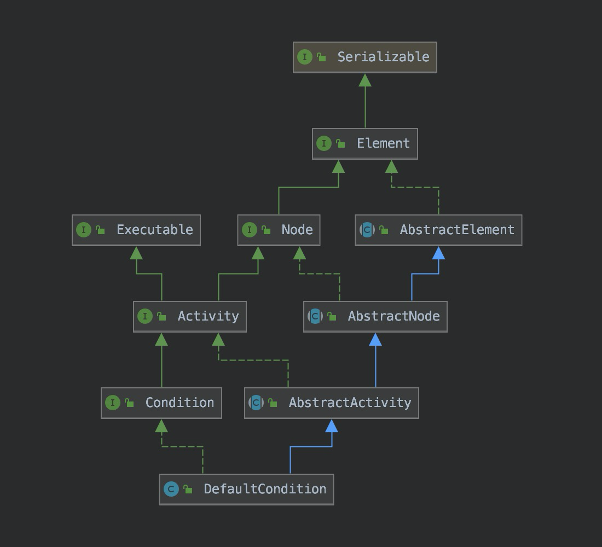 

如果我们要创建一个可以执行业务逻辑的`Condition`，只需要实现`ConditionDelegate`接口，__`onCondition`方法的返回值决定了整个流程的走向，若返回`true`则会走`LinkType.TRUE`分支，若返回`false`则会走`LinkType.FALSE`分支__

```java
package com.github.liuyehcf.framework.rule.engine.runtime.delegate;

import com.github.liuyehcf.framework.flow.engine.runtime.delegate.context.ConditionContext;

/**
 * @author hechenfeng
 * @date 2019/4/27
 */
public interface ConditionDelegate extends Delegate {

    /**
     * method invoke when condition is reached
     *
     * @param context context of execution
     * @throws Exception exceptions
     */
    boolean onCondition(ConditionContext context) throws Exception;
}
```

__其中，`context`可用于__

1. 获取属性值
1. 设置属性值（通过该方法设置属性值，会被引擎记录，作用于聚合逻辑，并且变更信息会保存到执行Trace当中）
1. 获取环境变量（直接操作环境变量进行属性值的设置，不会被引擎记录，慎用）
1. 添加attribute（添加属性值，用于存储业务数据，与环境变量隔离）

### 2.4.3 Listener  

__`Listener`不是规则拓扑结构中的节点，`Listener`必须依附于节点而存在，包括__

1. `Rule`（`global/node` Scope）
    * 只允许对`Sub Rule`配置`node`的监听
    * 可以对`Rule`或`Sub Rule`配置`global`监听
1. `Activity`（`node` Scope）
    * `Action`
    * `Condition`
1. `Gateway`（`node` Scope）
    * `JoinGateway`
    * `ExclusiveGateway`

__event: Listener触发时机__

1. `before`: 执行链路刚刚到达该`Listener`所依附的节点时触发（此时依附的节点尚未执行相关逻辑）
1. `success`: 该`Listener`所依附的节点正常执行时触发
    * 对于`Action`、`Condition`这类节点，当节点执行未抛出异常时，才会触发`success`监听
    * 对于`JoinGateway`、`ExclusiveGateway`这类节点，由于不包含执行逻辑，意味着不可能抛出异常，因此必然触发`success`监听
1. `failure`: 当依附的节点抛出异常时，会触发该类型的监听
    * 该类型的监听只能用于感知异常情况，但无法处理异常。换言之，在该监听处理完毕之后，该异常仍然会向上层继续抛出

__scope: Listener的范围__

1. `node`: 节点级别的监听，该监听可以依附于`Action`、`Condition`、`Gateway`
1. `global`: 规则级别的监听，即仅在规则开始前/成功执行/执行异常后触发
    * 如果规则存在多个执行分支，那么`success/failure`监听也只会执行一次
    * __例如下面的示意图，如果`actionA`、`actionB`和`actionC`都正常执行，那么该`GlobalSuccessListener`同样只会执行一次__

  

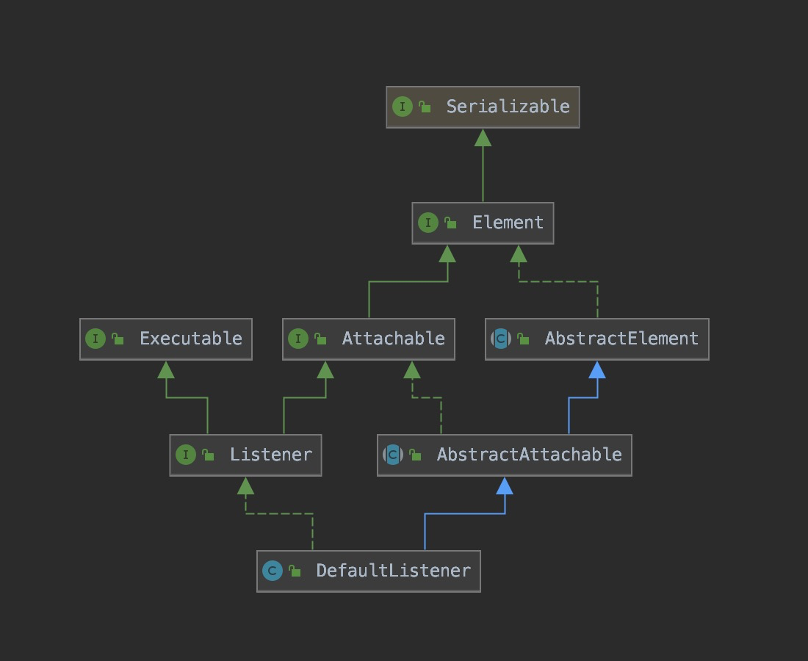  

如果我们要创建一个可以执行业务逻辑的`Listener`，只需要实现`ListenerDelegate`接口

```java
package com.github.liuyehcf.framework.rule.engine.runtime.delegate;

import com.github.liuyehcf.framework.flow.engine.runtime.delegate.context.ListenerContext;

/**
 * @author hechenfeng
 * @date 2019/4/27
 */
public interface ListenerDelegate extends Delegate {

    /**
     * method invoke when listener is reached
     *
     * @param context context of execution
     * @throws Exception exceptions
     */
    default void onBefore(ListenerContext context) throws Exception {
        // default implementation
    }

    /**
     * method invoke when bound element' execution succeeded
     *
     * @param context context of execution
     * @throws Exception exceptions
     */
    default void onSuccess(ListenerContext context, Object result) throws Exception {
        // default implementation
    }

    /**
     * method invoke when bound element' execution failed
     *
     * @param context context of execution
     * @throws Exception exceptions
     */
    default void onFailure(ListenerContext context, Throwable cause) throws Exception {
        // default implementation
    }
}
```

__其中，`context`可用于__

1. 获取属性值
1. 设置属性值（通过该方法设置属性值，会被引擎记录，作用于聚合逻辑，并且变更信息会保存到执行Trace当中）
1. 获取环境变量（直接操作环境变量进行属性值的设置，不会被引擎记录，慎用）
1. 添加attribute（添加属性值，用于存储业务数据，与环境变量隔离）

### 2.4.4 属性注入

`ActionDelegate`、`ConditionDelegate`、`ListenerDelegate`都继承了`Delegate`接口，本小结以`Delegate`泛指这三种具体的接口

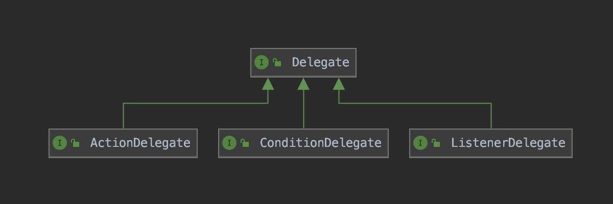 

__如果`Delegate`需要配置一些变量，那么必须使用`DelegateField`，规则引擎会自动注入，注入有以下两种方式__

1. `set`方法，优先使用该方式，也推荐使用该方式（不会受Spring-Aop的影响）
1. 字段注入（不推荐该方式，在Spring环境中，如果配置了AOP，那么该方式会失效，字段会注入到包装类）
* __如果节点未指定该参数，那么通过`DelegateField.getValue`方法获取到的值为null，但`DelegateField`本身一定不是null__

```java
import com.github.liuyehcf.framework.flow.engine.runtime.delegate.ActionDelegate;
import com.github.liuyehcf.framework.flow.engine.runtime.delegate.context.ActionContext;
import com.github.liuyehcf.framework.flow.engine.runtime.delegate.field.DelegateField;

/**
 * @author hechenfeng
 * @date 2019/7/10
 */
public class MyAction implements ActionDelegate {

    private DelegateField arg1;

    // arg2 没有定义set方法，那么注入会走字段反射
    private DelegateField arg2;

    // arg1 定义了set方法，那么注入会优先走set方法
    public void setArg1(DelegateField arg1) {
        this.arg1 = arg1;
    }

    @Override
    public void onAction(ActionContext context) {
        // 直接通过getValue获取实际的参数值
        Object value1 = arg1.getValue();
        Object value2 = arg2.getValue();
        // ...
    }
}
```

### 2.4.5 线程池隔离

当节点的业务逻辑较为复杂时，建议用业务线程池来处理业务逻辑，不要在规则引擎的线程池中执行业务逻辑

`ActionDelegate`、`ConditionDelegate`、`ListenerDelegate`可以通过`isAsync`方法设置成异步执行；可以通过`getAsyncTimeout`设置超时时间；可以通过`getAsyncExecutor`设置业务线程池，这些方法都定义在顶层接口`Delegate`中，默认是非异步模式

```Java
package com.github.liuyehcf.framework.rule.engine.runtime.delegate;

import com.github.liuyehcf.framework.flow.engine.FlowEngine;

import java.util.concurrent.ExecutorService;

/**
 * @author hechenfeng
 * @date 2019/4/27
 */
public interface Delegate {

    /**
     * whether execution in async mode
     * default is sync mode, which means that it will execute in the thread pool of the RuleEngine
     */
    default boolean isAsync() {
        return false;
    }

    /**
     * thread pool for executing asynchronous logic
     * default is RuleEngine's thread pool
     * <p>
     * invalid when isAsync() is false
     */
    default ExecutorService getAsyncExecutor() {
        return FlowEngine.getExecutor();
    }

    /**
     * timeout of async execution, the unit is milliseconds
     * non-positive value means wait until execution finished, default is 0
     * <p>
     * if the execution time exceeds the specified time, an interrupt signal is emitted,
     * but the response depends on the business code itself.
     * <p>
     * invalid when isAsync() is false
     */
    default long getAsyncTimeout() {
        return 0;
    }
}
```

## 2.5 Gateway

网关包括独占网关和聚合网关两种，下面分别介绍这两个网关，以及具体的使用场景

### 2.5.1 ExclusiveGateway

对于普通的节点，比如`Action`或者`Condition`，当后继节点有多个的时候，其默认的行为就是并发执行，如下图所示，`node 0`有n个后继节点，分别是`node 1`、`node 2`、...、`node n`。在`node 0`执行完毕后，__会`fork`出n个执行链路继续执行，并且在`fork`之后，每个执行链路独享环境变量，互不干扰__


但有时候，我们希望这n个后继节点，有且仅有一个能够执行，这个时候就需要使用独占网关`ExclusiveGateway`

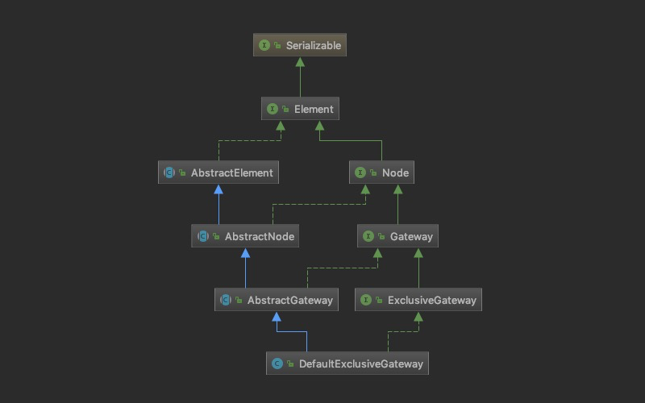 

__`ExclusiveGateway`的后继节点必须是`Condition`，`ExclusiveGateway`能够保证最多只有一条后继链路得以执行，并且执行的顺序与节点执行的顺序完全一致，如下图所示__。`exclusiveGateway`包含n个后继的`Condition`，分别是`condition 1`、`condition 2`、...、`condition n`，首先`condition 1`会优先执行，如果执行结果为true，那么继续执行`condition 1`的后续节点；如果执行结果为false，那么会执行`condition 2`，以此类推


### 2.5.2 JoinGateway

对于普通的节点，包含且仅包含一个前继节点（开始节点除外），但是`JoinGateway`允许包含多个前继节点，并进行聚合处理，包括

1. 环境变量的聚合，`JoinGateway`会聚合所有前置分支的环境变量，__如果不同分支同时修改了同一个变量的值，那么聚合后，该变量的值可能是任意一个分支的值__
1. 执行链路的聚合，`JoinGateway`会按照执行的时间顺序，聚合各前置分支的trace信息

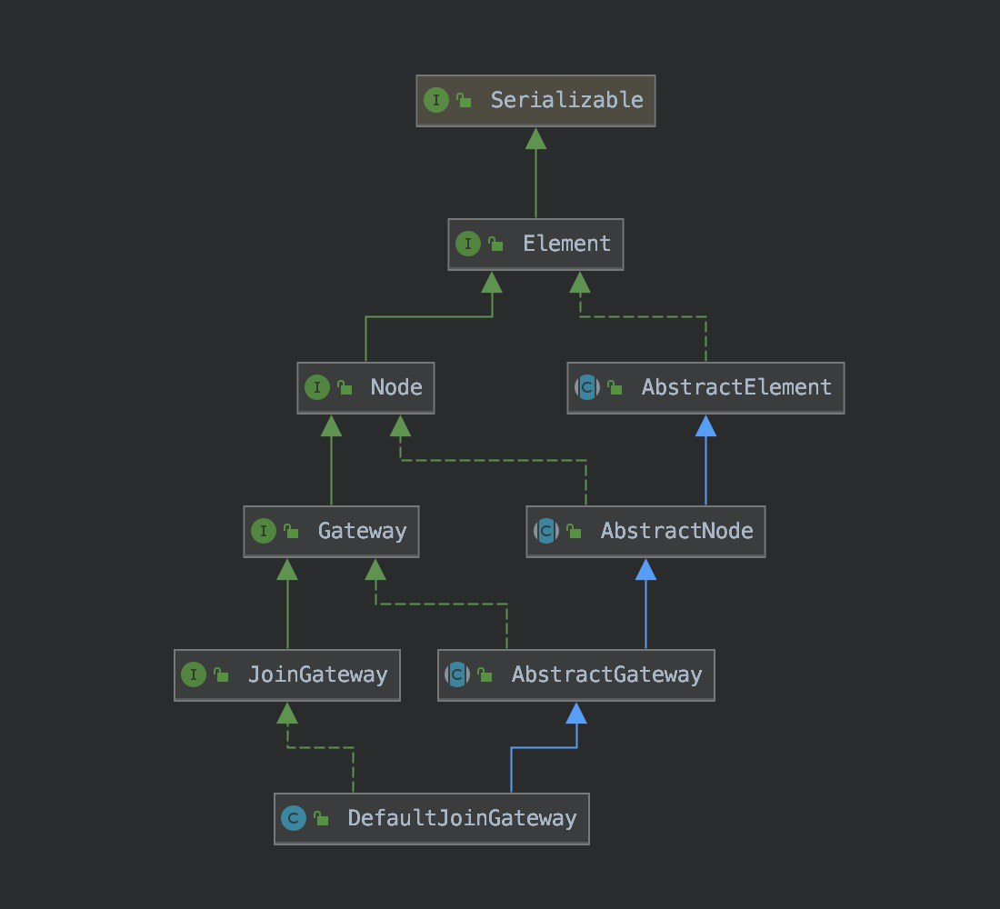 

`JoinGateway`包含三种聚合模式，`hard`模式、`soft`模式以及`or`模式，其中

1. `hard`模式，当且仅当所有前继节点全部到达时，才允许通过
1. `soft`模式，当且仅当所有`可达`的前继节点全部到达时，才允许通过
1. `or`模式，当`任意`前继到达后，即允许通过，且只允许通过一次

 

* `actionB`在`conditionA`的`TRUE`后继分支上，也就是说，只有`conditionA`的执行结果是true，`actionB`才会执行

__hard模式__

1. 如果`conditionA`的执行结果为true，那么gateway允许通过
1. 如果`conditionB`的执行结果为false，那么`actionB`就是不可达的，因此在`hard`的语义下，gateway不允许通过

__soft模式__

1. 如果`conditionA`的执行结果为true，那么gateway允许通过
1. 如果`conditionB`的执行结果为false，那么`actionB`就是不可达的，因此在`soft`的语义下，所有可达的前继节点（只有`actionA`），gateway允许通过

__or模式__

1. `actionA`或`actionB`中任意一个到达后，该gateway允许通过

## 2.6 Sub Rule

__规则引擎提供了`sub rule`的概念，极大地丰富了规则编排的灵活度。我们可以将一组节点拓扑放到`sub rule`中，并且很容易能够感知这组节点拓扑的执行结果__

考虑这样一个例子


__在这种场景下，`sub rule`与`or`模式的`JoinGateway`非常相似，但是存在一个明显的区别：`sub rule`可以感知这组节点拓扑的执行情况；`or`模式的`JoinGateway`无法感知这组节点拓扑的执行情况__

* 当`conditionA`、`conditionB`、`conditionC`中至少有一个节点的执行结果为true时，`or`模式的`JoinGateway`才允许通过，此时`actionB`才得以执行；若`conditionA`、`conditionB`、`conditionC`执行结果全部为false时，`actionB`不可达，且无法感知这一结果
* 当`sub rule`执行成功时，`actionB`得以执行；当`sub rule`执行失败时，`actionC`得以执行。可以看到，很容易感知到`sub rule`的执行结果

__如何定义`sub rule`执行成功：当存在任意一条分支成功执行（即任意一个分支到达叶子节点时），就认为`sub rule`执行成功，反之则认为`sub rule`执行失败__

__`sub rule`的监听：我们可以为`sub rule`配置`global`以及`node`级别的`Listener`__

* `global`级别的`Listener`，其行为与规则的`global`级别的`Listener`的行为一致
* `node`级别的`Listener`，其行为与普通节点的`Listener`行为一致
* 对于`sub rule`而言，`node`级别的监听与`global`级别的监听是等价的

## 2.7 异常

对于`Executable`，包括`Action`、`Listener`、`Listener`

* 如果在执行时抛出了`LinkExecutionTerminateException`异常，那么该节点的后续节点都会被标记为不可达，规则仍然处于正常状态
* 如果在执行时抛出了其他异常，那么规则执行进入异常状态，即该规则的所有分支所有节点终止执行，且`promise.isFailure`为true

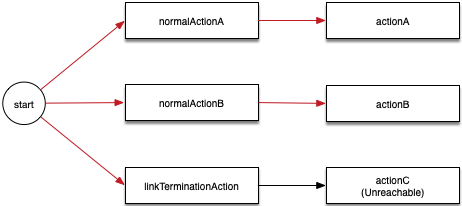

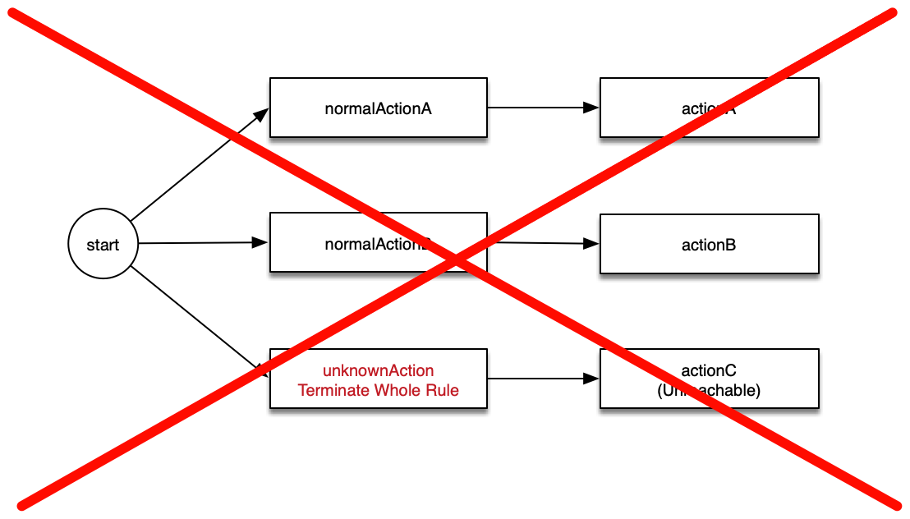

# 3 规则描述语言

## 3.1 级联

 

```
{
  actionA() {
    actionB()
  }
}
```

## 3.2 并联

 

```
{
    actionA(),
    actionB(){
        actionD(),
        actionE()
    },
    actionC()
}
```

## 3.3 `if`语句

 

```
{
    if(conditionA())
}
```

 

```
{
    if(conditionA()) {
        actionA()
    }
}
```

 

```
{
    if(conditionA()){
        actionA(),
        actionB(),
        actionC()
    }
}
```

## 3.4 `if else`语句

 

```
{
    if(conditionA()) {
        actionA()
    } else {
        actionB()
    }
}
```

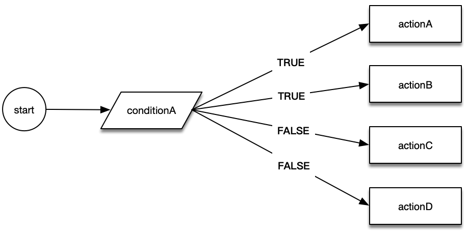 

```
{
    if(conditionA()){
        actionA(),
        actionB()
    } else {
        actionC(),
        actionD()
    }
}
```

## 3.5 `select`语句

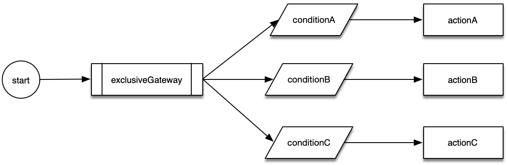 

```
{
    select {
        if(conditionA()){
            actionA()
        },
        if(conditionB()){
            actionB()
        },
        if(conditionC()){
            actionC()
        }
    }
}
```

## 3.6 `join`语句

__注意__

1. 用`&`来标注需要聚合的节点
1. 用`*`表示`hard`模式

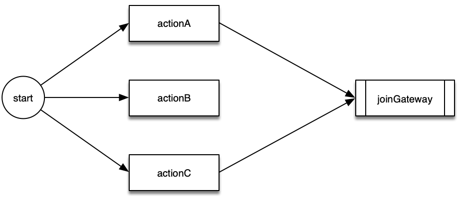 

__hard__

```
{
    join & {
        actionA()&,
        actionB(),
        actionC()&
    }
}
```

__soft__

```
{
    join {
        actionA()&,
        actionB(),
        actionC()&
    }
}
```

__or__

```
{
    join | {
        actionA()&,
        actionB(),
        actionC()&
    }
}
```

 

__hard__

```
{
    join & {
        if(conditionA()){
            actionC()
        } else {
            actionD()&
        },
        actionA()&,
        actionB()&
    }
}
```

__soft__

```
{
    join {
        if(conditionA()){
            actionC()
        } else {
            actionD()&
        },
        actionA()&,
        actionB()&
    }
}
```

__or__

```
{
    join | {
        if(conditionA()){
            actionC()
        } else {
            actionD()&
        },
        actionA()&,
        actionB()&
    }
}
```

## 3.7 `join then`语句

__注意：需要用`&`来标注需要聚合的节点__

 

__hard__

```
{
    join & {
        actionA()&,
        actionB(),
        actionC()&
    } then {
        actionD()
    }
}
```

__soft__

```
{
    join {
        actionA()&,
        actionB(),
        actionC()&
    } then {
        actionD()
    }
}
```

__or__

```
{
    join | {
        actionA()&,
        actionB(),
        actionC()&
    } then {
        actionD()
    }
}
```

 

__hard__

```
{
    join & {
        if(conditionA()){
            actionC()
        } else {
            actionD()&
        },
        actionA()&,
        actionB()&
    } then {
        actionE()
    }
}
```

__soft__

```
{
    join {
        if(conditionA()){
            actionC()
        } else {
            actionD()&
        },
        actionA()&,
        actionB()&
    } then {
        actionE()
    }
}
```

__or__

```
{
    join | {
        if(conditionA()){
            actionC()
        } else {
            actionD()&
        },
        actionA()&,
        actionB()&
    } then {
        actionE()
    }
}
```

## 3.8 `sub`语句

 

```
{
    actionA(){
        sub {
            actionB(),
            actionC(),
            actionD()
        }
    }
}
```

## 3.9 `sub then`语句

 

```
{
    actionA(){
        sub {
            join{
                actionB()&,
                actionC()&
            }then {
                actionD()
            }
        } then {
            actionE()
        }
    }
}
```

## 3.10 `sub then else`语句

 

```
{
    actionA(){
        sub{
            select{
                if(conditionA()){
                    actionB()
                },
                if(conditionB()){
                    actionC()
                }
            }
        } then {
            actionD()
        } else{
            actionE()
        }
    }
}
```

## 3.11 监听

__全局监听__

```
{
    actionA()
} [listenerA(event="before")]
```

__action监听__

```
{
    actionA()[listenerA(event="before")]
}
```

__condition监听__

```
{
    if(conditionA() [listenerA(event="before")]) {
        actionA()
    }
}
```

__exclusiveGateway监听__

```
{
    select {
        if(conditionA()){
            actionA()
        },
        if(conditionB()){
            actionB()
        }
    } [listenerA(event="before")]
}
```

__joinGateway监听__

```
{
    join {
        actionA()&,
        actionB()&
    } [listenerA(event="before")] then {
        actionD()
    }
}
```

__subRule监听__

```
{
    sub {
        actionA()
    }[listenerA(event="before")],
    
    sub {
        actionB()
    }[listenerB(event="success")] then {
        actionC()
    },
    
    sub {
        actionD()
    }[listenerC(event="before")] then {
        actionE()
    } else {
        actionF()
    }
}
```

__监听均支持多个，以逗号分隔__

```
{
    actionA()[listenerA(event="before"), listenerB(event="success")]
}
```

## 3.12 节点参数

参数格式：`<name>=<value>`

其中`<value>`支持占位符和字面值，其中字面值包括int、long、16进制、8进制、float、double、String

占位符格式`${xxx.yyy.zzz}`

# 4 异步

## 4.1 Promise

__规则触发后会通过线程池全异步执行，提供promise用于感知规则执行状态以及获取规则执行结果（类似Netty的ChannelFuture/ChannelPromise），包含以下功能（全部并发安全）__

1. `boolean isCancelled()`: 判断规则是否被取消
1. `boolean isDone()`: 判断规则是否已完成（成功/失败/取消）
1. `boolean isSuccess()`: 判断规则是否执行成功
1. `boolean isFailure()`: 判断规则是否执行失败
1. `Throwable cause()`: 获取规则执行失败时的异常
1. `boolean tryCancel()`: 尝试取消规则，当规则尚未完成时，才会取消成功
1. `boolean trySuccess(T outcome)`: 尝试成功规则，当规则尚未完成时，且竞争成功时，返回true
1. `boolean tryFailure(Throwable cause)`: 尝试失败规则，当规则尚未完成时，且竞争成功时，返回true
1. `Promise addListener(PromiseListener listener)`: 添加监听，__保证监听一定执行（无论在规则执行时，或执行完成后添加，都会确保触发监听）__
1. `void sync()`: 同步阻塞，等待规则执行完毕，不会抛出异常
1. `boolean await(long timeout, TimeUnit unit)`: 同步阻塞指定时间，若在指定时间内规则执行结束（包括成功/失败/取消），返回true，否则false
1. `T get()`: 同步阻塞等待规则执行结果，若规则执行异常或者取消，将会抛出异常
1. `T get(long timeout, TimeUnit unit)`: 同步阻塞指定时间，等待规则执行结果，若在指定时间内规则执行异常（失败/取消）或者在指定时间内未完成，将会抛出异常

## 4.2 PromiseListener

__可以基于Promise配置监听，当规则正常或者异常终止时，会触发监听。类似Netty的ChannelFuture/ChannelPromise__

# 5 拦截器

规则引擎提供了类似spring-aop的拦截器机制，核心接口包括`DelegateInterceptor`以及`DelegateInvocation`，通过拦截器，我们可以轻松地实现一些业务能力，执行统计、日志打印等

`DelegateInterceptor`类似于`MethodInterceptor`，此外还提供了节点匹配的能力，可以通过`matches`方法来选择匹配节点

```java
package com.github.liuyehcf.framework.rule.engine.runtime.delegate.interceptor;

/**
 * @author hechenfeng
 * @date 2019/4/27
 */
public interface DelegateInterceptor {

    /**
     * whether given executableName matches this interceptor
     *
     * @param executableName executable name
     * @return whether matches
     */
    default boolean matches(String executableName) {
        return true;
    }

    /**
     * Implement this method to perform extra treatments before and
     * after the invocation.
     *
     * @param delegateInvocation delegate invoker
     * @return result of target delegate call
     */
    Object invoke(DelegateInvocation delegateInvocation) throws Throwable;
}
```

`DelegateInvocation`类似于`MethodInvocation`

```java
package com.github.liuyehcf.framework.rule.engine.runtime.delegate.interceptor;

import com.github.liuyehcf.framework.flow.engine.model.Element;
import com.github.liuyehcf.framework.flow.engine.model.ElementType;
import com.github.liuyehcf.framework.flow.engine.runtime.delegate.Delegate;
import com.github.liuyehcf.framework.flow.engine.runtime.delegate.context.ExecutableContext;

/**
 * @author hechenfeng
 * @date 2019/4/27
 */
public interface DelegateInvocation {

    /**
     * Proceed to the next interceptor in the chain.
     *
     * @return result of target delegate call
     */
    Object proceed() throws Throwable;

    /**
     * get target delegate
     *
     * @return target delegate
     */
    Delegate getDelegate();

    /**
     * get executable context
     *
     * @return executable context
     */
    ExecutableContext<? extends Element> getExecutableContext();

    /**
     * type of delegate (action/condition/listener)
     *
     * @return delegate type
     * @see com.github.liuyehcf.framework.rule.engine.model.Executable
     * @see com.github.liuyehcf.framework.rule.engine.model.ElementType
     */
    ElementType getType();

    /**
     * get array of argument name
     *
     * @return array of argument name
     */
    String[] getArgumentNames();

    /**
     * get array of argument value
     *
     * @return array of argument value
     */
    Object[] getArgumentValues();
}
```

# 6 Spring-Boot-Starter

集成了Spring-Boot-Start，无需任何配置即可集成规则引擎

## 6.1 配置`ActionDelegate`

1. Spring提供的`@Component`以及相关注解，那么节点的名称就是Bean的名称
1. `@ActionBean`注解，那么节点名称就是`ActionBean.name()`
* 如果配置了`DelegateField`，那么该`Bean`的类型务必标注成`@Scope(ConfigurableBeanFactory.SCOPE_PROTOTYPE)`

```java
import com.github.liuyehcf.framework.flow.engine.runtime.delegate.ActionDelegate;
import com.github.liuyehcf.framework.flow.engine.runtime.delegate.context.ActionContext;
import com.github.liuyehcf.framework.flow.engine.runtime.delegate.field.DelegateField;
import org.springframework.beans.factory.config.ConfigurableBeanFactory;
import org.springframework.context.annotation.Scope;
import org.springframework.stereotype.Component;

/**
 * @author hechenfeng
 * @date 2019/7/10
 */
@Component(value = "printAction")
@Scope(ConfigurableBeanFactory.SCOPE_PROTOTYPE)
public class PrintAction implements ActionDelegate {

    private DelegateField content;

    public void setContent(DelegateField content) {
        this.content = content;
    }

    @Override
    public void onAction(ActionContext context) {
        System.out.println(String.format("printAction. content=%s", content.getValue()));
    }
}
```

## 6.2 配置`ConditionDelegate`

1. Spring提供的`@Component`以及相关注解，那么节点的名称就是Bean的名称
1. `@ConditionBean`注解，那么节点名称就是`ConditionBean.name()`
* 如果配置了`DelegateField`，那么该`Bean`的类型务必标注成`@Scope(ConfigurableBeanFactory.SCOPE_PROTOTYPE)`

```java
import com.github.liuyehcf.framework.flow.engine.runtime.delegate.ConditionDelegate;
import com.github.liuyehcf.framework.flow.engine.runtime.delegate.context.ConditionContext;
import com.github.liuyehcf.framework.flow.engine.runtime.delegate.field.DelegateField;
import com.github.liuyehcf.framework.flow.engine.spring.boot.starter.annotation.ConditionBean;
import org.springframework.beans.factory.config.ConfigurableBeanFactory;
import org.springframework.context.annotation.Scope;

/**
 * @author hechenfeng
 * @date 2019/7/10
 */
@ConditionBean(names = "printCondition")
@Scope(ConfigurableBeanFactory.SCOPE_PROTOTYPE)
public class PrintCondition implements ConditionDelegate {

    private DelegateField content;

    public void setContent(DelegateField content) {
        this.content = content;
    }

    @Override
    public boolean onCondition(ConditionContext conditionContext) throws Exception {
        System.out.println(String.format("printCondition. content=%s", content.getValue()));
        return true;
    }
}
```

## 6.3 配置`ListenerDelegate`

1. Spring提供的`@Component`以及相关注解，那么节点的名称就是Bean的名称
1. `@ListenerBean`注解，那么节点名称就是`ListenerBean.name()`
* 如果配置了`DelegateField`，那么该`Bean`的类型务必标注成`@Scope(ConfigurableBeanFactory.SCOPE_PROTOTYPE)`

```java
import com.github.liuyehcf.framework.flow.engine.runtime.delegate.ListenerDelegate;
import com.github.liuyehcf.framework.flow.engine.runtime.delegate.context.ListenerContext;
import com.github.liuyehcf.framework.flow.engine.runtime.delegate.field.DelegateField;
import com.github.liuyehcf.framework.flow.engine.spring.boot.starter.annotation.ListenerBean;
import org.springframework.beans.factory.config.ConfigurableBeanFactory;
import org.springframework.context.annotation.Scope;

/**
 * @author hechenfeng
 * @date 2019/7/10
 */
@ListenerBean(names = "printListener")
@Scope(ConfigurableBeanFactory.SCOPE_PROTOTYPE)
public class PrintListener implements ListenerDelegate {

    private DelegateField content;

    public void setContent(DelegateField content) {
        this.content = content;
    }

    @Override
    public void onBefore(ListenerContext context) throws Exception {
        System.out.println(String.format("printListener onBefore. content=%s", content.getValue()));
    }

    @Override
    public void onSuccess(ListenerContext context, Object result) throws Exception {
        System.out.println(String.format("printListener onSuccess. content=%s", content.getValue()));
    }

    @Override
    public void onFailure(ListenerContext context, Throwable cause) throws Exception {
        System.out.println(String.format("printListener onFailure. content=%s", content.getValue()));
    }
}
```

## 6.4 配置`DelegateInterceptor`

__配置`DelegateInterceptor`__，可以用`@Scope`注解指定拦截器的先后顺序，其行为与Spring-Aop一致

```java
import com.alibaba.fastjson.JSON;
import com.github.liuyehcf.framework.flow.engine.runtime.delegate.interceptor.DelegateInterceptor;
import com.github.liuyehcf.framework.flow.engine.runtime.delegate.interceptor.DelegateInvocation;
import org.springframework.core.annotation.Order;
import org.springframework.stereotype.Component;

/**
 * @author hechenfeng
 * @date 2019/7/10
 */
@Component
@Order(value = 20)
public class MyDelegateInterceptor1 implements DelegateInterceptor {
    @Override
    public Object invoke(DelegateInvocation delegateInvocation) throws Throwable {
        System.err.println("enter MyDelegateInterceptor1");

        System.err.println(delegateInvocation.getExecutableContext().getFlowId());
        System.err.println(delegateInvocation.getExecutableContext().getFlowName());
        System.err.println(delegateInvocation.getExecutableContext().getInstanceId());
        System.err.println(delegateInvocation.getExecutableContext().getName());
        System.err.println(delegateInvocation.getType());
        System.err.println(JSON.toJSONString(delegateInvocation.getArgumentNames()));
        System.err.println(JSON.toJSONString(delegateInvocation.getArgumentValues()));

        Object proceed = delegateInvocation.proceed();

        System.err.println("exit MyDelegateInterceptor1");
        return proceed;
    }
}
```

# 7 数据统计

1. 规则执行链路：有多少条并行链路就会有多少个执行链路
1. 执行trace：每个执行链路中包含多个节点trace
    * 唯一的执行id
    * 执行节点名称
    * 执行节点参数
    * 执行节点起始时间
    * 执行节点结束时间
    * 执行节点变更的变量集
    * 执行中捕获的异常
    * 执行节点的attribute集合

# 8 最佳实践

## 8.1 非spring环境

```xml
<dependency>
    <groupId>com.github.liuyehcf</groupId>
    <artifactId>rule-engine</artifactId>
    <version>1.2.0</version>
</dependency>
```

## 8.2 示例

```java
import com.alibaba.fastjson.JSON;
import com.github.liuyehcf.framework.flow.engine.FlowEngine;
import com.github.liuyehcf.framework.flow.engine.promise.Promise;
import com.github.liuyehcf.framework.flow.engine.promise.PromiseListener;
import com.github.liuyehcf.framework.flow.engine.runtime.delegate.ActionDelegate;
import com.github.liuyehcf.framework.flow.engine.runtime.delegate.context.ActionContext;
import com.github.liuyehcf.framework.flow.engine.runtime.delegate.field.DelegateField;
import com.github.liuyehcf.framework.flow.engine.runtime.delegate.interceptor.DelegateInterceptor;
import com.github.liuyehcf.framework.flow.engine.runtime.delegate.interceptor.DelegateInvocation;
import com.github.liuyehcf.framework.flow.engine.runtime.statistics.ExecutionInstance;
import com.google.common.collect.Maps;

/**
 * @author hechenfeng
 * @date 2019/7/10
 */
public class TestMain {
    public static void main(String[] args) {

        // 注册一个action
        FlowEngine.registerActionDelegateFactory("greetAction", () -> {
            return new ActionDelegate() {

                private DelegateField name;

                @Override
                public void onAction(ActionContext context) throws Exception {
                    System.out.println(String.format("Hello, %s. This is rule engine!", (String) name.getValue()));
                }
            };
        });

        // 注册一个interceptor
        FlowEngine.registerDelegateInterceptorFactory(() ->
                new DelegateInterceptor() {
                    @Override
                    public Object invoke(DelegateInvocation delegateInvocation) throws Throwable {
                        try {
                            System.err.println("enter MyDelegateInterceptor");

                            System.err.println(delegateInvocation.getExecutableContext().getFlowId());
                            System.err.println(delegateInvocation.getExecutableContext().getFlowName());
                            System.err.println(delegateInvocation.getExecutableContext().getInstanceId());
                            System.err.println(delegateInvocation.getExecutableContext().getName());
                            System.err.println(String.format("argumentNames=%s", JSON.toJSONString(delegateInvocation.getArgumentNames())));
                            System.err.println(String.format("argumentValues=%s", JSON.toJSONString(delegateInvocation.getArgumentValues())));

                            return delegateInvocation.proceed();
                        } finally {
                            System.err.println(String.format("attributes=%s", JSON.toJSONString(delegateInvocation.getExecutableContext().getGlobalAttributes())));
                            System.err.println("exit MyDelegateInterceptor");
                        }
                    }
                });

        String dsl = "{\n" +
                "    greetAction(name=\"hechenfeng\")\n" +
                "}";

        Promise<ExecutionInstance> promise = FlowEngine.startFlow(dsl, Maps.newHashMap());

        // 注册监听
        promise.addListener(new PromiseListener<ExecutionInstance>() {
            @Override
            public void operationComplete(Promise<ExecutionInstance> promise) {
                System.out.println("trigger promise listener");
                if (promise.isSuccess()) {
                    System.out.println(JSON.toJSONString(promise.get()));
                } else if (promise.isFailure() && promise.cause() != null) {
                    promise.cause().printStackTrace();
                }
            }
        });

        // 同步阻塞等待规则执行完毕
        promise.sync();
    }
}
```

__输出__

```
enter MyDelegateInterceptor
431c0e69-361c-469b-813e-1abadbb441ba
null
2ed97aef-eed5-4d4b-8e41-397d1813bd64
greetAction
Hello, hechenfeng. This is rule engine!
argumentNames=["name"]
argumentValues=["hechenfeng"]
attributes={}
exit MyDelegateInterceptor
trigger promise listener
{"attributes":{},"endNanos":42968801169067,"id":"2ed97aef-eed5-4d4b-8e41-397d1813bd64","links":[{"env":{},"id":"ebb321f7-027d-4865-b25e-9c01544dfa35","traces":[{"endNanos":42968711375424,"executionId":0,"id":"1","startNanos":42968711375275,"type":"START"},{"arguments":[{"name":"name","value":"hechenfeng"}],"attributes":{},"endNanos":42968793883525,"executionId":1,"id":"2","name":"greetAction","propertyUpdates":[],"startNanos":42968719847516,"type":"ACTION"}]}],"rule":{"elements":[{"id":"1","listeners":[],"predecessors":[],"rule":{"$ref":"$.rule"},"successors":[{"argumentNames":["name"],"argumentValues":["hechenfeng"],"id":"2","linkType":"NORMAL","listeners":[],"name":"greetAction","predecessors":[{"$ref":"$.rule.elements[0]"}],"rule":{"$ref":"$.rule"},"successors":[],"type":"ACTION"}],"type":"START"},{"$ref":"$.rule.elements[0].successors[0]"}],"ends":[{"$ref":"$.rule.elements[0].successors[0]"}],"events":[],"id":"431c0e69-361c-469b-813e-1abadbb441ba","linkType":"NORMAL","listeners":[],"predecessors":[],"start":{"$ref":"$.rule.elements[0]"},"successors":[],"type":"SUB_RULE"},"startNanos":42968706815634,"unreachableLinks":[]}
```

## 8.3 spring环境

__maven依赖__

```xml
<dependency>
    <groupId>com.github.liuyehcf</groupId>
    <artifactId>rule-engine-spring-boot-starter</artifactId>
    <version>1.2.0</version>
</dependency>
```
