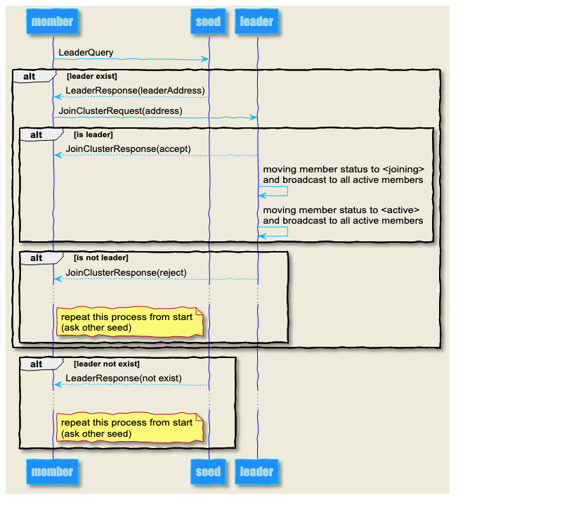
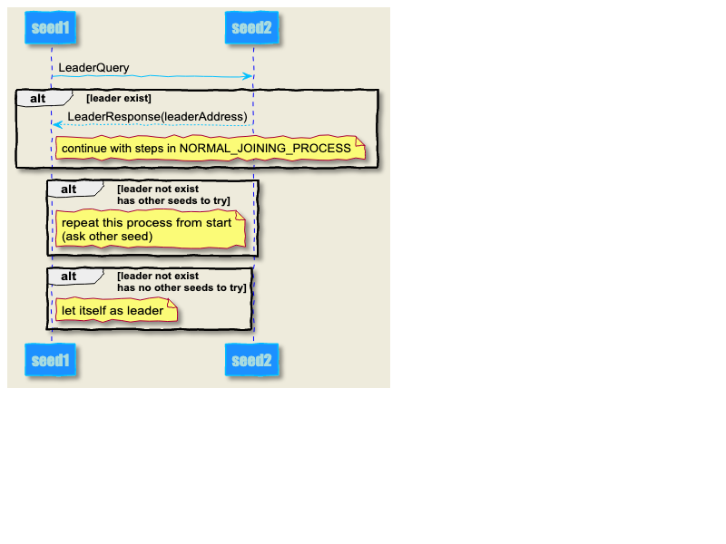
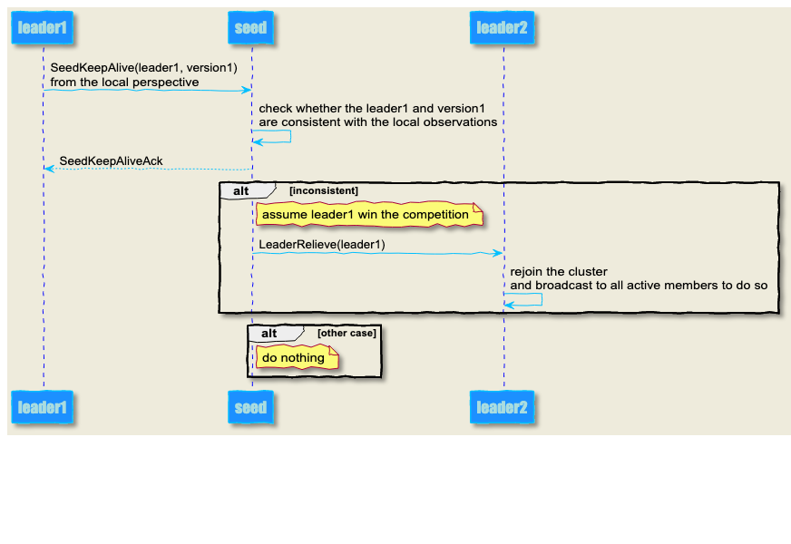
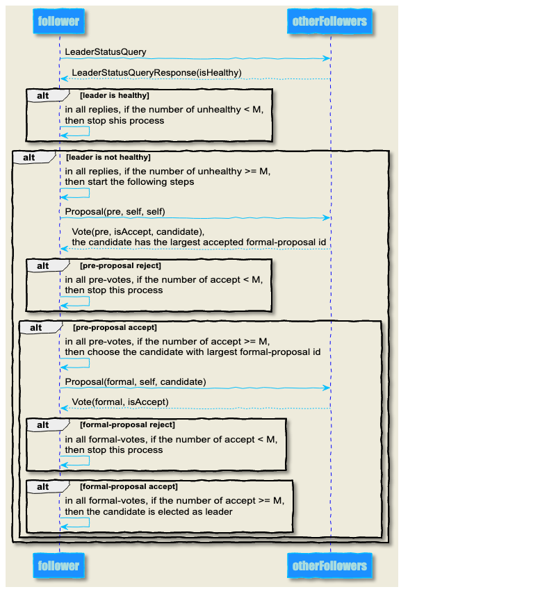
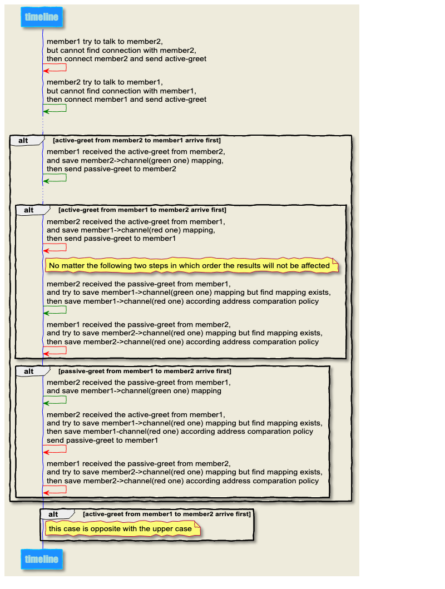

   * [设计](#设计)
      * [符号说明](#符号说明)
      * [事件处理机制](#事件处理机制)
         * [发送校验原则](#发送校验原则)
         * [接收校验原则](#接收校验原则)
      * [状态机](#状态机)
      * [集群规范](#集群规范)
   * [流程](#流程)
      * [普通节点加入流程(NORMAL_JOINING_PROCESS)](#普通节点加入流程normal_joining_process)
      * [种子节点加入流程(SEED_JOINING_PROCESS)](#种子节点加入流程seed_joining_process)
      * [leader冲突检测处理流程(LEADER_CONFLICT_PROCESS)](#leader冲突检测处理流程leader_conflict_process)
      * [leader选举](#leader选举)
      * [节点握手冲突](#节点握手冲突)
   * [异常case](#异常case)
      * [case1](#case1)
      * [case2](#case2)
      * [case3](#case3)
      * [case4](#case4)

# 设计

## 符号说明

| 符号 | 含义 |
|:--|:--|
| `N` | 集群节点总数，至少为1。**集群的总数不可动态扩展** |
| `M` | 集群高可用最少存活节点数，`M = N/2 + 1`。**当投票数量至少为`M`时，才算通过** |
| `seed` | 种子节点，是集群接入的入口 |
| `leader` | 集群中的管理者，只有它才能修改成员的状态 |
| `follower` | 集群中的普通成员，包括`seed`和`non-seed`，可以参与投票 |
| `member` | 泛指集群节点，可以是`seed`、`follower`、`leader` |
| `version` | 集群的版本，每次产生新`leader`后，版本递增 |
| `receiver` | 特指`com.github.liuyehcf.framework.io.athena.Receiver` |
| `heartbeatInterval` | 心跳间隔时间 |
| `heartbeatTimeout` | 心跳超时时间 |
| `ttlTimeout` | 一个节点允许的最大宕机时间（包括网络异常） |
| `retryInterval` | 重试时间间隔，包括重新加入集群，重新询问`leader`状态等等 |
| `proposal` | 提案，分为预提案阶段（`pre`）和正式提案阶段（`formal`） |
| `vote` | 投票，与`proposal`对应，分为预提案阶段（`pre`）和正式提案阶段（`formal`） |
| `proposer` | 提出提案的成员 |
| `candidate` | 提案推举的希望成为`leader`的成员 |

## 事件处理机制

事件分为两块，系统事件（`system-event`）以及（`custom-event`）

1. `system-event`由系统框架负责处理，该事件不会流转到用户的`receiver`中
1. `system-event`会流转到用户的`receiver`中，依据匹配逻辑进行相应处理

### 发送校验原则

发送事件的一方必须确保发送事件准确无误，即事件本身表达的信息与发送事件时集群的状态相匹配（只关注那一刻就行了）

* 比如`LeaderKeepAliveAck`时，需要校验自身是否为leader，校验成功后才发送

### 接收校验原则

假设集群中的两个节点`A`和节点`B`，节点`A`观测到节点`B`的状态为`λ1`，于是基于`A`基于这个观测结果，将观测结果`λ1`以及处理方法`θ`发送给`B`

当`B`收到处理方法`θ`时，需要校验当前状态是否为`λ1`

* 若`B`的观测结果也是`λ1`，那么执行`θ`
* 若`B`的观测结果不为`λ1`，那么不处理

## 状态机

**节点状态及其含义如下**

| 状态 | 说明 |
|:--|:--|
| `joining` | 初始化状态，在节点第一次与`leader`发生通信请求加入集群时，`leader`会将其标记为`joining`状态 |
| `active` | 在节点成功加入集群后，`leader`会将其标记为`active`状态 |
| `unreachable` | 当`leader`在超过`heartbeatTimeout`后没有收到该节点的心跳包，会将该节点标记为`unreachable` |
| `leaving` | 当`leader`在超过`ttlTimeout`后没有收到节点心跳后，会将该节点标记为`leaving` |
| `removed` | `leader`会将该节点标记为`leaving`后会进行一些清理工作，清理完毕后，将节点标记为`removed` |

**状态机**

| 当前状态 | 条件 | 下一个状态 |
|:--|:--|:--|
| / | 加入集群 | `joining` |
| `joining` | 做完初始化工作 | `active` |
| `active` | `leader`超过`heartbeatTimeout`后没有收到心跳 | `unreachable` |
| `unreachable` | `heartbeatTimeout`后重新又收到了心跳 | `active` |
| `unreachable` | `leader`超过`ttlTimeout`后没有收到心跳 | `leaving` |
| `leaving` | 做完清理工作 | `removed` |

## 集群规范

**集群启动**

* `seed`启动：
	1. 遍历所有其他`seed`，尝试加入集群
	1. 若加入成功，结束
	1. 若加入失败，直接将自己作为`leader`，`version = 1`，结束
* `non-seed`启动：
	1. 遍历所有`seed`，尝试加入集群
	1. 若加入成功，结束
	1. 若加入失败，休息`retryInterval`之后，重复该流程直至结束

**leader宕机后恢复**

1. 当存活节点数量至少为`M`时，可以选举出新的`leader`，集群恢复到正常状态
1. 当存活节点数少于`M`后，集群变得不可用，节点本身仍然会尝试发起选举流程，但必然以失败告终
	* **`seed`：当超过`3 * ttlTimeout`后仍然没有`leader`被选举出来，那么清理集群，递增版本号，直接将自身作为`leader`**
	* **`non-seed`：当超过`3 * ttlTimeout`后仍然没有`leader`被选举出来，那么清理集群，重置版本号为1，重新尝试加入集群**

**KeepAlive**

1. **`follower`需要与`leader`保持心跳**
	* `follower`发起`LeaderKeepAlive`
	* `leader`回复`LeaderKeepAliveAck`
	* `leader`超过`heartbeatTime`没收到`follower`的`LeaderKeepAlive`事件后，将`folllower`的状态标记为`unreachable`，并通知其他`follower`
	* `leader`超过`ttlTimeout`没收到follower的`LeaderKeepAlive`事件后，将`folllower`的状态标记为`leaving`、`removed`，随后将该`follower`移除集群，并通知其他`follower`
	* `follower`超过`ttlTimeout`没有收到`leader`的`LeaderKeepAliveAck`事件后，重置本地`leader`，发起`leader`选举流程，推举自己为`leader`
1. **`leader`需要与所有`seed`保持心跳，避免产生孤岛**
	* `leader`发起`SeedKeepAlive`
	* `seed`回复`SeedKeepAliveAck`
	* 若`seed`发现对方观测的`leader`与本地观测的`leader`不是同一个，则依据一定的原则，发送`LeaderRelieve`强制让一个`leader`退位
	* `leader`收到该消息后，通知其他`follower`重新尝试加入集群（需要清空集群，并重置版本为1），自己也重新尝试加入集群（需要清空集群，并重置版本为1）
	* **`leader`冲突时比较策略：若版本不同，取版本号较大的那个，若版本相同，取`Address`较大的那个（先比较host字符串，再比较port）**


**follower probe**

1. 与`leader`保持心跳，间隔时间为`heartbeatInterval`，检查`leader`的状态

**leader probe**

1. 与`follower`保持心跳，并进行异常处理，处理流程不再赘述
1. 与所有`seed`保持心跳，避免产生孤岛
	* **如果所有节点的种子配置相同，则可以完全避免**
	* **如果所有节点的种子配置不同，则有一定概率产生孤岛**

**paxos**

1. 在一次选举中，每个提案的`id`必须不同
1. 在一次选举结束后，要避免收到上一次的提案，造成`candidate`污染
1. 在新`leader`产生后需要清空本地状态，包括最大提案编号以及该提案对应的`candidate`
1. 本地状态有效期为`ttlTimeout * 3`

# 流程

## 普通节点加入流程(NORMAL_JOINING_PROCESS)

**流程图源码**

```plantuml
skinparam backgroundColor #EEEBDC
skinparam handwritten true

skinparam sequence {
	ArrowColor DeepSkyBlue
	ActorBorderColor DeepSkyBlue
	LifeLineBorderColor blue
	LifeLineBackgroundColor #A9DCDF
	
	ParticipantBorderColor DeepSkyBlue
	ParticipantBackgroundColor DodgerBlue
	ParticipantFontName Impact
	ParticipantFontSize 17
	ParticipantFontColor #A9DCDF
	
	ActorBackgroundColor aqua
	ActorFontColor DeepSkyBlue
	ActorFontSize 17
	ActorFontName Aapex
}

participant member
participant seed
participant leader

member -> seed: LeaderQuery
alt leader exist
seed --> member: LeaderResponse(leaderAddress)
member -> leader: JoinClusterRequest(address)
alt is leader
leader --> member: JoinClusterResponse(accept)
leader -> leader: moving member status to <joining>\nand broadcast to all active members
leader -> leader: moving member status to <active>\nand broadcast to all active members
end
alt is not leader
leader --> member: JoinClusterResponse(reject)
...
note right member: repeat this process from start\n(ask other seed)
end
end
alt leader not exist
seed --> member: LeaderResponse(not exist)
...
note right member: repeat this process from start\n(ask other seed)
end
```

**流程图**



## 种子节点加入流程(SEED_JOINING_PROCESS)

**流程图源码**

```plantuml
skinparam backgroundColor #EEEBDC
skinparam handwritten true

skinparam sequence {
	ArrowColor DeepSkyBlue
	ActorBorderColor DeepSkyBlue
	LifeLineBorderColor blue
	LifeLineBackgroundColor #A9DCDF
	
	ParticipantBorderColor DeepSkyBlue
	ParticipantBackgroundColor DodgerBlue
	ParticipantFontName Impact
	ParticipantFontSize 17
	ParticipantFontColor #A9DCDF
	
	ActorBackgroundColor aqua
	ActorFontColor DeepSkyBlue
	ActorFontSize 17
	ActorFontName Aapex
}

participant seed1
participant seed2

seed1 -> seed2: LeaderQuery
alt leader exist
seed2 --> seed1: LeaderResponse(leaderAddress)
note right seed1: continue with steps in NORMAL_JOINING_PROCESS
end
alt leader not exist\nhas other seeds to try
note right seed1: repeat this process from start\n(ask other seed)
end
alt leader not exist\nhas no other seeds to try
note right seed1: let itself as leader
end
```

**流程图**



## leader冲突检测处理流程(LEADER_CONFLICT_PROCESS)

`leader1`发送`SeedKeepAlive`事件给`seed`，`seed`本地观测的`leader`为`leader2`

**流程图源码**

```plantuml
skinparam backgroundColor #EEEBDC
skinparam handwritten true

skinparam sequence {
	ArrowColor DeepSkyBlue
	ActorBorderColor DeepSkyBlue
	LifeLineBorderColor blue
	LifeLineBackgroundColor #A9DCDF
	
	ParticipantBorderColor DeepSkyBlue
	ParticipantBackgroundColor DodgerBlue
	ParticipantFontName Impact
	ParticipantFontSize 17
	ParticipantFontColor #A9DCDF
	
	ActorBackgroundColor aqua
	ActorFontColor DeepSkyBlue
	ActorFontSize 17
	ActorFontName Aapex
}

participant leader1
participant seed
participant leader2

leader1 -> seed: SeedKeepAlive(leader1, version1)\nfrom the local perspective
seed -> seed: check whether the leader1 and version1 \nare consistent with the local observations
seed --> leader1: SeedKeepAliveAck
alt inconsistent
note right seed: assume leader1 win the competition
seed -> leader2: LeaderRelieve(leader1)
leader2 -> leader2: rejoin the cluster\nand broadcast to all active members to do so
end
alt other case
note right seed: do nothing
end
```

**流程图**



## leader选举

**在开始选举之前，需要先询问一下其他节点，在对方的视角下`leader`是否正常，如果得到至少`M`个回复表示`leader`不正常时，才开始选举流程，这是为了避免某个节点由于断线恢复造成的不必要的`leader`选举**

**流程图源码**

```plantuml
skinparam backgroundColor #EEEBDC
skinparam handwritten true

skinparam sequence {
	ArrowColor DeepSkyBlue
	ActorBorderColor DeepSkyBlue
	LifeLineBorderColor blue
	LifeLineBackgroundColor #A9DCDF
	
	ParticipantBorderColor DeepSkyBlue
	ParticipantBackgroundColor DodgerBlue
	ParticipantFontName Impact
	ParticipantFontSize 17
	ParticipantFontColor #A9DCDF
	
	ActorBackgroundColor aqua
	ActorFontColor DeepSkyBlue
	ActorFontSize 17
	ActorFontName Aapex
}

participant follower
participant otherFollowers

follower -> otherFollowers: LeaderStatusQuery
otherFollowers --> follower: LeaderStatusQueryResponse(isHealthy)
alt leader is healthy
follower -> follower: in all replies, if the number of unhealthy < M,\nthen stop shis process
end
alt leader is not healthy
follower -> follower: in all replies, if the number of unhealthy >= M,\nthen start the following steps
follower -> otherFollowers: Proposal(pre, self, self)
otherFollowers --> follower: Vote(pre, isAccept, candidate),\nthe candidate has the largest accepted formal-proposal id
alt pre-proposal reject
follower -> follower: in all pre-votes, if the number of accept < M,\nthen stop this process
end
alt pre-proposal accept
follower -> follower: in all pre-votes, if the number of accept >= M,\nthen choose the candidate with largest formal-proposal id
follower -> otherFollowers: Proposal(formal, self, candidate)
otherFollowers --> follower: Vote(formal, isAccept)
alt formal-proposal reject
follower -> follower: in all formal-votes, if the number of accept < M,\nthen stop this process
end
alt formal-proposal accept
follower -> follower: in all formal-votes, if the number of accept >= M,\nthen the candidate is elected as leader
end
end
end
```

**流程图**



## 节点握手冲突

**核心原则**

1. 主动发起连接的一方会发送`active-greet`
1. 被动连接的一方收到`active-greet`之后会回复`passive-greet`
1. 只有当收到对方发送的`greet`时，才去缓存建立`address`与`channel`的映射关系
1. 当缓存映射关系的时候发现映射关系已经存在了，那么仅留下主动发起一方`address`较小的连接

在下面的流程中，假设`address(member1)<address(member2)`

* 红色的线代表又`member1`主动发起的连接
* 绿色的线代表由`member2`主动发起的连接

```plantuml
skinparam backgroundColor #EEEBDC
skinparam handwritten true

skinparam sequence {
	ArrowColor DeepSkyBlue
	ActorBorderColor DeepSkyBlue
	LifeLineBorderColor blue
	LifeLineBackgroundColor #A9DCDF
	
	ParticipantBorderColor DeepSkyBlue
	ParticipantBackgroundColor DodgerBlue
	ParticipantFontName Impact
	ParticipantFontSize 17
	ParticipantFontColor #A9DCDF
	
	ActorBackgroundColor aqua
	ActorFontColor DeepSkyBlue
	ActorFontSize 17
	ActorFontName Aapex
}

participant timeline

timeline-[#red]>timeline: member1 try to talk to member2,\nbut cannot find connection with member2,\nthen connect member2 and send active-greet
timeline-[#green]>timeline: member2 try to talk to member1,\nbut cannot find connection with member1,\nthen connect member1 and send active-greet
...
alt active-greet from member2 to member1 arrive first
timeline-[#green]>timeline: member1 received the active-greet from member2,\nand save member2->channel(green one) mapping,\nthen send passive-greet to member2
...
alt active-greet from member1 to member2 arrive first
timeline-[#red]>timeline: member2 received the active-greet from member1,\nand save member1->channel(red one) mapping,\nthen send passive-greet to member1
note right timeline: No matter the following two steps in which order the results will not be affected 
timeline-[#green]>timeline: member2 received the passive-greet from member1,\nand try to save member1->channel(green one) mapping but find mapping exists,\nthen save member1->channel(red one) according address comparation policy
timeline-[#red]>timeline: member1 received the passive-greet from member2,\nand try to save member2->channel(red one) mapping but find mapping exists,\nthen save member2->channel(red one) according address comparation policy
end
alt passive-greet from member1 to member2 arrive first
timeline-[#green]>timeline: member2 received the passive-greet from member1,\nand save member1->channel(green one) mapping
timeline-[#red]>timeline: member2 received the active-greet from member1,\nand try to save member1->channel(red one) mapping but find mapping exists,\nthen save member1-channel(red one) according address comparation policy\nsend passive-greet to member1
timeline-[#red]>timeline: member1 received the passive-greet from member2,\nand try to save member2->channel(red one) mapping but find mapping exists,\nthen save member2->channel(red one) according address comparation policy
end
end
alt active-greet from member1 to member2 arrive first
note right timeline: this case is opposite with the upper case
end
```

**流程图**



# 异常case

## case1

1. member1和member2同时发现leader断线，于是询问其他member，得到的回复都是leader不在线
1. 于是member1和member2同时发起leader选举，都推选自己为leader
1. member1的提案先发到其他member手中，因此大家都同意了，于是member1成为了leader
1. 此时member2已经接受了member1为leader，由于与之前的调查，大家都说leader不在线所以也发起了leader选举

如何避免：发起选举时的版本必须为发起leader状态查询时的版本+1

## case2

系统消息乱序

1. leader 先发了 JoinClusterResponse，后发了 MemberStatusUpdate
1. member也是先收到 JoinClusterResponse 后收到 MemberStatusUpdate
1. 但由于完全异步处理，MemberStatusUpdate可能优先于JoinClusterResponse执行
1. 导致了member的状态变成了joining，虽然会自动回复，但是没必要

## case3

ClusterAlignment 只能同步 active的节点?

## case4

1. 某个member正在join流程
1. 处理joining流程的这个leader收到了LeaderRelieve
1. 由于member不是active状态，因此没有给这个member发送ReJoinCluster
1. 所以这个节点在超过3个ttlTimeout之后，会重新尝试加入集群